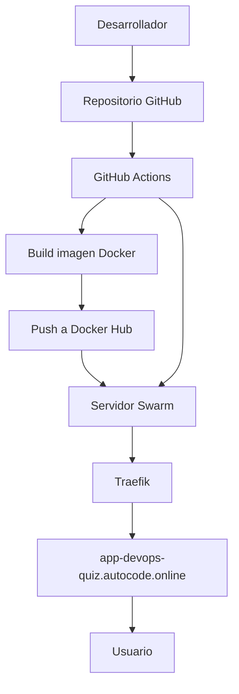

```mermaid
flowchart TD
  Dev[Desarrollador];
  Repo[Repositorio GitHub];
  Actions[GitHub Actions];
  Build[Build imagen Docker];
  Push[Push a Docker Hub];
  Server[Servidor Swarm];
  Traefik[Traefik];
  Domain[app-devops-quiz.autocode.online];
  User[Usuario];

  Dev --> Repo;
  Repo --> Actions;
  Actions --> Build;
  Build --> Push;
  Push --> Server;
  Actions --> Server;
  Server --> Traefik;
  Traefik --> Domain;
  Domain --> User;
```